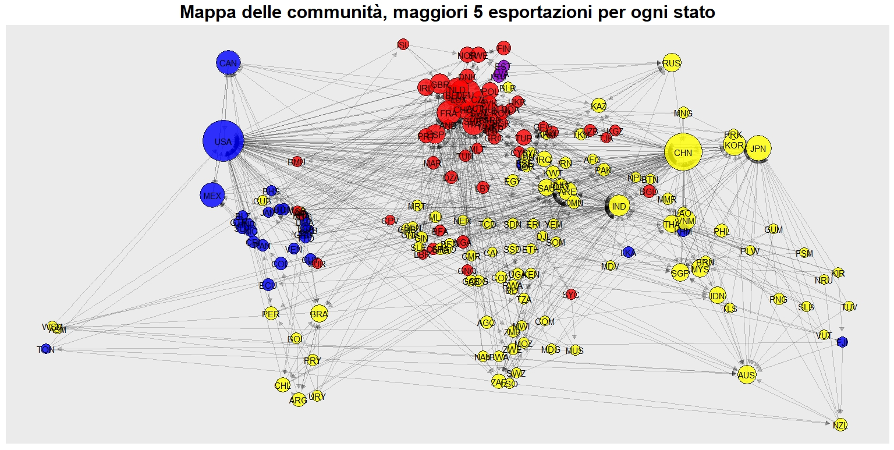

<!-- toc:true -> nel pdf verrà incluso un indice delle sezioni -->


```{r setup, include=FALSE}
knitr::opts_chunk$set(echo = TRUE)
```

# Introduzione
```{r, message=FALSE, echo =FALSE}
library(tidyverse)
library(igraph)
library(ggraph)
library(knitr)
library(bookdown)
library(moments)
setwd("C:/Users/Bruno/Desktop/Advanced_Data_Science/Esame")

load("analisi3.Rdata")
```
## LA RETE DEL COMMERCIO MONDIALE
Gli anni 2000 sono stati segnati da importanti eventi geopolitici che hanno trasformato profondamente l’economia globale. L'evento più importante è stato il diffondersi e radicarsi della globalizzazione, a cui si assiste ancora oggi. Il XXI secolo è stato caratterizzato anche da guerre, crisi finanziarie e sviluppo di nuove economie emergenti. Per studiare l'impatto di questi fenomeni sul commercio globale può essere utile analizzare le relazioni tra i paesi sotto il punto di vista della Network Science. Una possibile rappresentazione per analizzare la realtà consiste nel considerare il network degli import e export internazionali. Questo approccio verrà seguito nel seguente report analizzando reti dove i nodi sono gli stati del mondo in diversi anni, e gli archi tra due stati $i$ e $j$ sono presenti se lo stato $i$ esporta verso lo stato $j$. Il peso dell'arco è pari al valore monetario in dollari americani del totale dei beni esportati in quell'anno. Quindi si sta analizzando grafi diretti e pesati. L'analisi verterà sul confronto tra vari anni comprei tra il 1999 e 2023 per studiare i cambiamenti nelle rete in questo periodo.
I dati utilizzati provengono dal database BACI sviluppato dal CEPII [@CEPII]. BACI (\textit{Base pour l’Analyse du Commerce International}) fornisce dati dettagliati sul commercio internazionale, coprendo più di 190 paesi e oltre 5.000 prodotti nel periodo compreso tra il 1994 e il 2023. Questo database nasce dall’esigenza di disporre di statistiche commerciali più precise e disaggregate rispetto a quelle fornite da altre fonti, poiché i dati riportati dai diversi paesi spesso presentano discrepanze e incoerenze. BACI si basa sulle informazioni raccolte da COMTRADE, il database delle Nazioni Unite, che raccoglie i flussi commerciali dichiarati da ciascun paese.

Uno degli aspetti chiave della costruzione di BACI è il processo di riconciliazione dei dati commerciali bilaterali. Ogni paese riporta le proprie esportazioni e importazioni, ma mentre i dati sulle esportazioni sono generalmente riportati FOB (\textit{Free on Board}), cioè escludendo i costi di trasporto e assicurazione, i dati sulle importazioni sono solitamente riportati CIF (\textit{Cost, Insurance, and Freight}), che includono questi costi. Ciò significa che, per uno stesso scambio commerciale, i valori dichiarati dall’importatore e dall’esportatore possono differire. Per correggere questa discrepanza, BACI stima il CIF/FOB ratio, un coefficiente che permette di eliminare i costi di trasporto e assicurazione dai dati di importazione, rendendoli comparabili con quelli di esportazione.

Un altro elemento fondamentale nella costruzione del database è la valutazione dell’affidabilità delle dichiarazioni dei paesi. Per ogni coppia di paesi, BACI analizza la discrepanza tra il valore dichiarato dall’importatore e quello dichiarato dall’esportatore, calcolando un indicatore di qualità per ciascun paese. Questo indicatore viene poi utilizzato per ponderare le due fonti di dati e ottenere una stima più affidabile dei flussi commerciali.

BACI adotta anche una metodologia specifica per armonizzare le quantità commercializzate. Le unità di misura dichiarate nei dati COMTRADE non sono sempre uniformi (ad esempio, alcuni prodotti vengono riportati in tonnellate, altri in libbre, pezzi o metri cubi di materiale, ...). Il database applica coefficienti di conversione per esprimere tutte le quantità in un'unica unità di misura (nell'esempio tonnellate), permettendo così un confronto più accurato tra i diversi prodotti.

Il CEPII, l’istituto che ha sviluppato BACI, è un centro di ricerca economica francese specializzato in economia internazionale. Il suo obiettivo principale è fornire dati e analisi sulle relazioni commerciali globali, le politiche economiche, i flussi di investimento e la competitività tra paesi. Oltre a BACI, il CEPII ha sviluppato altri importanti database come CHELEM, che fornisce una visione macroeconomica del commercio internazionale, e MacMap, che offre informazioni dettagliate sulle tariffe doganali e le barriere commerciali.

Grazie alla sua metodologia di armonizzazione e alla sua ampia copertura, BACI rappresenta uno strumento essenziale per l’analisi del commercio internazionale. Il database è ampiamente utilizzato per studiare la specializzazione commerciale dei paesi, le politiche tariffarie, la competitività internazionale e l’evoluzione dei prezzi nei mercati globali.

## DOMANDE DI RICERCA

Con questo studio è di interesse approfondire e provare a rispondere alle seguenti domande?

- Centralità dei nodi: Quali sono i Paesi più importanti nel commercio globale? Sono variati negli anni? Per rispondere si analizzerà quali sono i paesi più centrali nella rete di esportazioni in base a misure come la centralità basata su strength, eigen-centrality,betweenness e PageRank.

- Cluster economici regionali: È possibile individuare comunità di paesi che tendono a commerciare maggiormente tra loro? Come si correlano questi cluster con la geografia o con accordi commerciali regionali?

- La rete del commercio globale è resiliente?

- Che relazione c'è tra il potere e la centralità dei Paesi?

- In che modo gli eventi geopolitici e le crisi economiche si riflettono sulla dinamica temporale del network degli scambi?

# METODI UTILIZZATI E RISULTATI

## PREPARAZIONE DEI DATASET 

I dati sono contenuti all'interno di sei file CSV, nel seguente chunk di codice è possibile analizzarne un'antemprima di quello relativo al 1999. Gli altri hanno tutti una struttura simile


```{r}
head(baci_example)
```

Le variabili sono:
\begin{itemize}
\item t: anno di riferimento
\item i: codice paese esportatore
\item j: codice paese importatore
\item k: codice tipologia di beni esportati
\item v: valore dei beni esportati
\item q: quantità di beni esportati
\end{itemize}

Ogni riga corrisponde all'esportazione di una tipologia di beni da un paese i verso un paese j durante l'anno di riferimento.
Di seguito il codice relativo alla operazione di pulizia e preparazione dei dati

```{r, eval=FALSE}

baci<- read.csv("BACI_HS92_Y1999_V202401b.csv")

baci_example <- baci[c(1:100,5994474:5994574),]

names(baci)<- c("year","fromCode","toCode","product","value","quantity")

baci <- baci %>% group_by(fromCode) %>%
  mutate(valuetot = sum(value))


baci99 <- baci %>%
  group_by(fromCode, toCode, year) %>%
  summarise(value = sum(value, na.rm = TRUE), .groups = "drop")


baci_c<- read.csv("BACI_CCODES.csv")
names(baci_c)<- c("fromCode","fromName", "iso2", "from")

baci99clean <- baci99 %>%
  left_join(baci_c %>% select(from, fromCode, fromName), join_by(fromCode))

names(baci_c)<- c("toCode","toName", "iso2", "to")

baci99clean <- baci99clean %>%
  left_join(baci_c %>% select(to, toCode, toName), join_by(toCode))

baci99clean <- baci99clean %>%
  filter(!to %in% c("W00", "O19", "A79", "A59", "X1", "UMI", "HMD", 
                    "ATF","SGS","PYF","GRL", "MAC", "S19", "MNP", "_X ",
                    "CYM", "E19", "F19", "MHL", "TCA", "CUW", "SXM", "X2",
                    "ATA", "CXR", "FLK", "NFK", "ESH", "X1 ", "WLF", "FRO",
                    "XX ", "UMI", "HKG", "IOT", "SPM", "BLM", "BVT", "TKL",
                    "SHN", "PCN", "NIU", "NCL", "COK", "CCK", "X2 ","ABW","MSR", "STP",
                    "GIB","VCT", "BES"
  )) %>%
  filter(!from %in% c("W00", "O19", "A79", "A59", "X1", "UMI", "HMD", 
                      "ATF","SGS","PYF","GRL", "MAC", "S19", "MNP", "_X ",
                      "CYM", "E19", "F19", "MHL", "TCA", "CUW", "SXM", "X2",
                      "ATA", "CXR", "FLK", "NFK", "ESH", "X1 ", "WLF", "FRO",
                      "XX ", "UMI", "HKG", "IOT", "SPM", "BLM", "BVT", "TKL",
                      "SHN", "PCN", "NIU", "NCL", "COK", "CCK", "X2 ","ABW","MSR", "STP",
                      "GIB","VCT", "BES"
  )) 

cbind(unique(baci99clean$to), unique(baci99clean$toName))
cbind(unique(baci99clean$from), unique(baci99clean$fromName))

baci99clean %>%
  group_by(to) %>%
  mutate(totalImp = sum(value), relValueImp = value/totalImp) %>%
  distinct(toName, totalImp) %>%
  arrange(desc(totalImp))

baci99clean <- baci99clean %>%
  group_by(from) %>%
  mutate(totalExp = sum(value), relValue = value/totalExp)

top_exports99 <- baci99clean %>%
  group_by(from) %>%
  slice_max(value, n = 5)

nodi_99 <- data.frame(cbind(name = unique(baci99clean$to))) 

long <- read.csv("country-coord.csv")
names(long)[c(3,5,6)]<- c("name", "latitude","longitude")

conti<- read.csv("continents.csv")
names(conti)[c(1,5)]<- c("cont","name")

conti <- conti %>% distinct(name, .keep_all = T)

nodi_99 <- nodi_99 %>%
  left_join(long %>% select(name, latitude, longitude), join_by(name))

nodi_99 <- nodi_99 %>%
  left_join(conti %>% select(name,cont), join_by(name))

export_99 <- data.frame(from = baci99clean$from, to = baci99clean$to, 
                        value= baci99clean$value)

g_99 = graph_from_data_frame(export_99, directed=T, vertices = nodi_99)

E(g_99)$weight= baci99clean$value
```

Il precedente codice viene ripetuto per sei volte (una per ogni anno). In modo da ottenere sei data-frame completi con tutte le informazioni relative alle esportazioni (archi), sei dati frame contenenti le informazioni relative ai nodi, sei grafi in rappresentazione igraph contenenti tutte le transazioni e un grafo in rappresentazione igraph contenti solo le 5 esportazioni più importanti per ogni paese nel 2023.  


Un esempio di data-frame contenente le informazioni relative agli archi 
```{r}
head(baci99clean)
```


Un esempio di dati-frame contenente le informazioni realtive ai nodi
```{r}
head(nodi_99)
```


## ANALISI ESPLORATIVA

La reti analizzate presentano un numero di nodi che va da 186 a 195 e un numero di archi che va da 20149 a 26510 come si può osservare nella tabella \@ref(tab:table-dim). Il numero di archi o la densità crescenti sono dei buoni indicatori dell'aumento della globalizzazione del nostro sistema economico: sempre più paesi sono connessi direttamente e commerciano tra loro. Le reti sono caratterizzate da un'elevata reciprocità superiore all'85%. Questo implica che se un paese $i$ esporta ad uno $j$, è vero quasi sempre anche il viceversa. Quindi, molto probabilmente, anche $j$ esporta a $i$. Tutte e sei le reti sono connesse.

```{r table-dim}
nedges<- c(dim(baci99clean)[1],dim(baci04clean)[1], dim(baci09clean)[1],dim(baci14clean)[1], dim(baci19clean)[1], dim(baci23clean)[1] )

nnodi<-c(length(unique(baci99clean$toName)),length(unique(baci04clean$toName)),length(unique(baci09clean$toName)),
         length(unique(baci14clean$toName)),
             length(unique(baci19clean$toName)),length(unique(baci23clean$toName)))

rec<- c(reciprocity(g_99),reciprocity(g_04),reciprocity(g_09),reciprocity(g_14),
reciprocity(g_19),reciprocity(g_23))

den<- round(c(edge_density(g_99),edge_density(g_04),edge_density(g_09),edge_density(g_14),
edge_density(g_19),edge_density(g_23)),4)

c(is_connected(g_99),is_connected(g_04),is_connected(g_09),is_connected(g_14),
is_connected(g_19),is_connected(g_23) )
dimdata <- data.frame(nedges, nnodi,rec,den)

rownames(dimdata)<- c("1999","2004", "2009","2014","2019", "2023")
colnames(dimdata)<- c("archi", "nodi", "reciprocità", "densità archi")
round(dimdata,3) %>% kable(booktabs=T, caption = "Caratteristiche descrittive delle reti analizzate")
```


```{r, eval=FALSE}
  ggraph(lay) + 
    geom_edge_link(edge_alpha=0.2,arrow = arrow(length = unit(2, 'mm'), type="closed"), 
end_cap= circle(5 ,"mm"), show.legend = NA) + 
    geom_node_point( aes(fill=cont,size =(strength(g5_23, mode = "all"))),alpha=0.8, 
                     color = "black", shape=21,show.legend = T) +
    scale_size_continuous(range = c(6, 25), guide = F) +
    geom_node_text(aes(label=nodi5_23$name)) +
    scale_edge_width(range = c(1, 6), guide=F) +
    scale_fill_manual(values = c("yellow", "red","blue", "green", "white"
    , "darkviolet"), name="Continent")   +
    ggtitle("Mappa dei paesi come network geografico, maggiori 5 esportazioni per ogni stato") + 
    theme(legend.text = element_text(size = 16),
          legend.title = element_text(size = 18),
          plot.title = element_text(size = 23, face = "bold", hjust = 0.5))+
    guides(fill = guide_legend(override.aes = list(size = 8)))
```


\begin{figure}[h!]
    \centering
    \includegraphics[width=1.1\linewidth]{plot/rete_countries.jpeg}
    \caption{Rete degli stati secondo la loro posizione geografica reale. I colori rappresentano i continenti a cui gli stati appartengono. Sono considerate solo le cinque esportazioni più importanti per ogni Stato}
    \label{geo-plot}
\end{figure}

In figura \ref{geo-plot} si può osservare la rete delle esportazioni secondo la poszione geografica degli stati. I continenti più importanti risultano essere Nord-America, Asia e Europa. I Paesi più importanti sembrano essere Stati Uniti e Cina seguiti da India, Korea del Sud, Giappone e alcuni Paesi europei. Questo grafico tuttavia non chiarisce in modo esaustivo l'importanza dei singoli Stati né ci permette di capire l'effetto delle relazioni tra due paesi tenuto conto quelle dei loro partner commerciali. Per questo è necessario procedere con un altro grafico.


```{r, eval=FALSE}
set.seed(1)
  ggraph(g5_23, layout = 'fr', weights = log(E(g5_23)$value)) +  # Force-directed layout
    geom_edge_link(alpha=0.2, arrow = NULL,show.legend = F)+            # Draw edges
    geom_node_point(alpha=.8, aes(fill=cont,size =(strength(g5_23, mode = "all"))), 
                     color = "black", shape=21,show.legend = T) +  # Draw nodes
    scale_size_continuous(range = c(6, 25), guide = F) +
    geom_node_text(aes(label = nodi5_23$name))+  # Add node labels
    scale_fill_manual(values = c("yellow", "red","blue", "green", "white"
                                   , "darkviolet"), name="Continent")   +
    ggtitle("Mappa dei paesi nel 2023 come network force oriented, maggiori 5 esportazioni per ogni stato") + 
    theme(legend.text = element_text(size = 16),  
          legend.title = element_text(size = 18),
          plot.title = element_text(size = 23, face = "bold", hjust = 0.5))+
    guides(fill = guide_legend(override.aes = list(size = 8)))
  
```


La figura \ref{fr-plot} è ottenuta allentando il vincolo geografico sulla posizione dei paesi nella rete commerciale e applicando un \textit{force-directed algorithm} sugli stessi dati. I colori, le etichette e le dimensioni del cerchio di ciascun nodo-paese sono gli stessi di prima.
Semplificando, l'algoritmo agisce come un sistema di molle equilibrato
che minimizza l'energia del sistema. In altre parole, è come se i paesi fossero collegati attraverso delle molle: i Paesi che sono collegati con un peso maggiore tendono a rimanere vicini, mentre quelli che non sono collegati tendono a essere distanti tra loro. Tuttavia, la posizione di ciascun Paese non dipende solo dai suoi legami bilaterali, ma anche dall'effetto indiretto degli altri: i partner commerciali dei suoi partner commerciali contribuiranno a determinare la posizione del paese nella rete. Questo grafico permette di cogliere l'effetto multilaterale sui flussi bilaterali, attribuendo a ogni paese una posizione rispetto a tutti gli altri paesi della rete commerciale e dipendendo dall'intero sistema commerciale. Il vantaggio di rappresentare il commercio internazionale come una rete è quindi la possibilità di visualizzare l'effetto della relazione tra i paesi sulla struttura della rete stessa, rivelando schemi difficilmente visibili con altri approcci (@de2014network).
Attraverso questa disposizione è possibile individuare tre blocchi centrali principali: Stati Uniti, China, e blocco europeo guidato dalla Germania. I paesi dell'Oceania sono più vicini al blocco asiatico, mentre quelli del Nord e Sud America a Stati Uniti. I paesi africani sono sparsamente distribuiti ma la maggior parte sono vicini al blocco cinese e a quello europeo. 


\begin{figure}[h!]
    \centering
    \includegraphics[width=1.1\linewidth]{plot/rete_countries_fr.jpeg}
    \caption{Rete degli stati tenuto conto delle cinque esportazioni più importanti per paese. Realizzata con algoritmo force-directed. La dimensione di ogni nodo è proporzionale alla sua log(strength). I colori corrispondono al continente/area geografica di appartenenza.}
    \label{fr-plot}
\end{figure}


```{r hs-deg-in, fig.cap="Istogramma del grado in entrata dei nodi"}
hist(degree(g_23, mode="in"), freq = F, nclass = 20, main="Istogramma del grado in entrata dei nodi", xlab="in-degree")
```
```{r hs-deg-out, fig.cap="Istogramma del grado in uscita dei nodi"}
hist(degree(g_23, mode="out"), freq = F, nclass = 20, main="Istogramma del grado in uscita dei nodi", xlab="out-degree")
```
```{r hs-stren, fig.cap="Istogramma della strength dei nodi"}
hist((strength(g_23, mode="all")), freq = F, nclass = 50, main="Istogramma della strength dei nodi", xlab="Strength")
```

Per quanto concerne la distribuzione del grado dei sembra esserci molta più informazione nell'utilizzare una misura basata sul peso degli archi chiamata strength (il grado pesato), piuttosto che il grado inteso come numero di paesi con cui un nodo è connesso. Questo si può osservare nelle figure  \@ref(fig:hs-deg-in), \@ref(fig:hs-deg-out) e \@ref(fig:hs-stren) perché la distribuzione della strength è molto più sparsa e volatile. Il grado risulta poco utile dato che la rete è molto connessa e sono pochi i Paesi poco connessi. Il grado inteso come numero di paesi con cui uno stato ha rapporti commerciali non è utile a discriminare il ruolo dei Paesi all'interno della rete. Molto più utile è l'intesità di questi scambi


## INDICI DI CENTRALITÀ

Per individurare gli stati più importanti all'interno della rete globale si studieranno gli indici di centralità strength, betweenness, eigen-centrality e PageRank. 


```{r stren-tab}
stren99 <-round((strength(g_99, mode="all"))[order(strength(g_99, mode="all"), 
decreasing=TRUE)]/max((strength(g_99, mode="all"))),3)[1:10]

stren04 <-round((strength(g_04, mode="all"))[order(strength(g_04, mode="all"), 
decreasing=TRUE)]/max((strength(g_04, mode="all"))),3)[1:10]

stren09 <-round((strength(g_09, mode="all"))[order(strength(g_09, mode="all"), 
decreasing=TRUE)]/max((strength(g_09, mode="all"))),3)[1:10]

stren14 <-round((strength(g_14, mode="all"))[order(strength(g_14, mode="all"), 
decreasing=TRUE)]/max((strength(g_14, mode="all"))),3)[1:10]

stren19 <-round((strength(g_19, mode="all"))[order(strength(g_19, mode="all"), 
decreasing=TRUE)]/max((strength(g_19, mode="all"))),3)[1:10]

stren23 <-round((strength(g_23, mode="all"))[order(strength(g_23, mode="all"), 
decreasing=TRUE)]/max((strength(g_23, mode="all"))),3)[1:10]

strenghtTot<-cbind(names(stren99),stren99,names(stren04),stren04,names(stren09),stren09, names(stren14),stren14,names(stren19),stren19,
                   names(stren23),stren23)

colnames(strenghtTot)<- c("1999","1999","2004","2004","2009","2009","2014","2014",
"2019","2019","2023","2023")
rownames(strenghtTot)<-NULL

strenghtTot%>% kable(booktabs=T, caption = "10 paesi con la maggiore strenght al variare degli anni")

anni <- c(rep(1999,10), rep(2004,10), rep(2009,10), rep(2014,10), rep(2019,10), rep(2023,10))

x<-rbind(strenghtTot[,c(1,2)],strenghtTot[,c(3,4)],strenghtTot[,c(5,6)],strenghtTot[,c(7,8)],
strenghtTot[,c(9,10)],strenghtTot[,c(11,12)])
x1<- cbind(x,anni )

dati <- data.frame(stato=x1[,1], valore=as.numeric(x1[,2]),anno=x1[,3] )
```


```{r eval=F}
ggplot(dati, aes(x = anno, y = log(valore), color = stato, group = stato)) +
  geom_point(size = 4) +  # Pallini
  geom_line(linewidth = 1.5,) +   # Linee che collegano gli anni per ogni stato
    geom_text(aes(label = stato), vjust = -0.5, hjust=+0.5, size = 6) +
  labs(title = "Evoluzione della Strenght nel tempo",
       x = "Anno",
       y = "log(normalized Strength)") +
  expand_limits(y = c(min(log(dati$valore-0.001)), max(log(dati$valore+0.2)))) +  # Aggiunge spazio sopra e sotto
  theme_minimal()    +
  theme(legend.text = element_text(size = 18),  
          legend.title = element_text(size = 20),
        axis.title = element_text(size=20),
        axis.text = element_text(size=18),
          plot.title = element_text(size = 26, face = "bold", hjust = 0.5))

```


\begin{figure}[h!]
    \centering
    \includegraphics[width=1\linewidth]{plot/strength.jpeg}
    \caption{Rete degli stati tenuto conto delle 5 esportazioni più importanti per paese. Realizzata con algoritmo force-directed. La dimensione di ogni nodo è proporzionale alla sua log(strength). I colori corrispondono al continente/area geografica di appartenenza.}
    \label{strength-plot}
\end{figure}


La strength è un indice di centralità che corrisponde al grado pesato di un nodo, ovvero la somma del peso degli archi in entrata e/o in uscita del nodo. Nel caso in considerazione rappresenta il totale del valore delle esportazioni e importazioni di un paese. Il potere commerciale di uno stato non è solo dato dalla sua capacità esportativa ma anche dal suo volume di scambi in entrata. Due casi all'estremo sono Stati Uniti e Russia: il primo utilizza dazi commerciali come arma politica per imporre condizioni ai paesi partner, il secondo minaccia di interrompere le esportazioni strumento di potere in politica estera. 
Come si può osservare in figura \ref{strength-plot} e in tabella \@ref(tab:stren-tab) la Cina ha avuto una crescita dei volumi dell'import e dell'export superando persino gli Stati dal 2019 al 2023, seppur lievemente. La Germania pur crescendo come volume d'affari tra il 1999 e il 2009 ha registrato un calo che la riporta ai livelli inziali. I restanti Paesi hanno un andamento simile alla Germania ma con un volume di scambi ridotto. In generale si può osservare che l'andamento è quello di un sistema in cui China e Stati Uniti mantengono il primato in termini di volume dell'import-export. Le altre economie sviluppate mantengono le loro posizioni, ma aumenta il loro divario da Cina e Stati Uniti. 


```{r bet-tab}
bt99 <-round((betweenness(g_99, weights = 1/E(g_99)$weight)[order(betweenness(g_99,
weights = 1/E(g_99)$weight), decreasing=TRUE)])/max(betweenness(g_99,
                                                          weights=1/E(g_99)$weight)),3)[1:10]

bt04 <-round((betweenness(g_04, weights = 1/E(g_04)$weight)[order(betweenness(g_04,
weights = 1/E(g_04)$weight), decreasing=TRUE)])/max(betweenness(g_04,
                                                                weights=1/E(g_04)$weight)),3)[1:10]

bt09 <-round((betweenness(g_09, weights = 1/E(g_09)$weight)[order(betweenness(g_09,
weights = 1/E(g_09)$weight), decreasing=TRUE)])/max(betweenness(g_09, weights=1/E(g_09)$weight)),3)[1:10]

bt14 <-round((betweenness(g_14, weights = 1/E(g_14)$weight)[order(betweenness(g_14,
weights = 1/E(g_14)$weight), decreasing=TRUE)])/max(betweenness(g_14,
                                                                weights=1/E(g_14)$weight)),3)[1:10]

bt19 <-round((betweenness(g_19, weights = 1/E(g_19)$weight)[order(betweenness(g_19,
weights = 1/E(g_19)$weight), decreasing=TRUE)])/max(betweenness(g_19,
                                                                weights=1/E(g_19)$weight)),3)[1:10]


bt23 <-round((betweenness(g_23, weights = 1/E(g_23)$weight)[order(betweenness(g_23,
weights = 1/E(g_23)$weight), decreasing=TRUE)])/max(betweenness(g_23,
                                                                weights=1/E(g_23)$weight)),3)[1:10]


btTot<-cbind( names(bt99),bt99,names(bt04),bt04,names(bt09),bt09,
names(bt19),bt19,names(bt14),bt14,names(bt23),bt23) 

colnames(btTot)<- c("1999","1999","2004","2004","2009","2009","2014","2014","2019","2019",
"2023","2023")
rownames(btTot)<-NULL

btTot %>% kable(booktabs=T, caption = "10 paesi con la maggiore betweenness al variare degli anni")
```


```{r eval=F}
bt_data<-rbind(btTot[,c(1,2)],btTot[,c(3,4)],btTot[,c(5,6)],btTot[,c(7,8)],btTot[,c(9,10)]
,btTot[,c(11,12)])
bt_data<- cbind(bt_data,anni )

bt_data <- data.frame(stato=bt_data[,1], valore=as.numeric(bt_data[,2]),anno=bt_data[,3] )

ggplot(bt_data, aes(x = anno, y = log(valore), color = stato, group = stato)) +
  geom_point(size = 4) +  
  geom_line(linewidth = 1.5) +   
    geom_text(aes(label = stato), vjust = -0.5, hjust=+0.5, size = 6) +
  labs(title = "Evoluzione della Betweenness nel tempo",
       x = "Anno",
       y = "log(normalized betweenness)") +
  expand_limits(y = c(min(log(bt_data$valore-0.001)), max(log(bt_data$valore+0.2)))) + 
  theme_minimal() +
    theme(legend.text = element_text(size = 18),  
          legend.title = element_text(size = 20),
        axis.title = element_text(size=20),
        axis.text = element_text(size=18),
          plot.title = element_text(size = 26, face = "bold", hjust = 0.5))

```

\begin{figure}[h!]
    \centering
    \includegraphics[width=1.1\linewidth]{plot/betweenness.jpeg}
    \caption{Rete degli stati secondo la loro posizione geografica reale. I colori rappresentano i continenti a cui gli stati appartengono}
    \label{bet-plot}
\end{figure}
La betweennes degli Stati è sempre una misura di centralità, ma tiene conto della capacità di un Paese di essere uno snodo commerciale fondamentale all'interno della rete. La betweenness è sempre calcolata tenendo conto del peso dell'arco ma utilizzando il suo reciproco come distanza tra due nodi: maggiore è l'intensità dei rapporti commerciali minore è la distanza. Osservando la figura \@ref{bet-plot} e la tabella \@ref(tab:bet-tab) si può notare che rispetto alla strength i 10 paesi con la maggior betweenness tendono a variare di più nel tempo. Dal 2009 gli U.S.A. e la Germania hanno perso il loro primato di snodi commerciali a dispetto della Cina e mantengono un livello simile tra loro. Gli altri dopo i primi tre seguono un andamento simile al grafico della strength (\ref{strength-plot}).


```{r eg-tab}
eg99 <-round((eigen_centrality(g_99)$vector[order(eigen_centrality(g_99)$vector, 
decreasing=TRUE)])/max(eigen_centrality(g_99)$vector),3)[1:10]

eg04 <-round((eigen_centrality(g_04)$vector[order(eigen_centrality(g_04)$vector, 
decreasing=TRUE)])/max(eigen_centrality(g_04)$vector),3)[1:10]

eg09 <-round((eigen_centrality(g_09)$vector[order(eigen_centrality(g_09)$vector, 
decreasing=TRUE)])/max(eigen_centrality(g_09)$vector),3)[1:10]

eg14 <-round((eigen_centrality(g_14)$vector[order(eigen_centrality(g_14)$vector, 
decreasing=TRUE)])/max(eigen_centrality(g_14)$vector),3)[1:10]

eg19 <-round((eigen_centrality(g_19)$vector[order(eigen_centrality(g_19)$vector, 
decreasing=TRUE)])/max(eigen_centrality(g_19)$vector),3)[1:10]

eg23 <-round((eigen_centrality(g_23)$vector[order(eigen_centrality(g_23)$vector, 
decreasing=TRUE)])/max(eigen_centrality(g_23)$vector),3)[1:10]

egTot<-cbind( names(eg99),eg99,names(eg09),eg09,names(eg04),eg04, names(eg14),eg14, names(eg19),eg19, names(eg23),eg23)

colnames(egTot)<- c("1999","1999","2004","2004","2009","2009","2014","2014",
                    "2019","2019","2023","2023")
rownames(egTot)<-NULL

egTot %>% kable(booktabs=T, caption = "10 paesi con la maggiore  eigen-centrality al variare degli anni")
```


```{r eval=F}
eg_data<-rbind(egTot[,c(1,2)],egTot[,c(3,4)],egTot[,c(5,6)],egTot[,c(7,8)], egTot[,c(9,10)],egTot[,c(11,12)])
eg_data<- cbind(eg_data,anni )

eg_data <- data.frame(stato=eg_data[,1], valore=as.numeric(eg_data[,2]),anno=eg_data[,3] )

ggplot(eg_data, aes(x = anno, y = log(valore), color = stato, group = stato)) +
  geom_point(size = 4) +  
  geom_line(linewidth = 1.5) +   
    geom_text(aes(label = stato), vjust = -0.5, hjust=+0.5, size = 6) +
  labs(title = "Evoluzione della eigen-centrality nel tempo",
       x = "Anno",
       y = "log(normalized eigen-centrality") +
  expand_limits(y = c(min(log(eg_data$valore-0.001)), max(log(eg_data$valore+0.2)))) +
  theme_minimal()+
    theme(legend.text = element_text(size = 18),  
          legend.title = element_text(size = 20),
        axis.title = element_text(size=20),
        axis.text = element_text(size=18),
          plot.title = element_text(size = 26, face = "bold", hjust = 0.5)) +
      theme(legend.text = element_text(size = 18),  
          legend.title = element_text(size = 20),
        axis.title = element_text(size=20),
        axis.text = element_text(size=18),
          plot.title = element_text(size = 26, face = "bold", hjust = 0.5))

```
\begin{figure}[h!]
    \centering
    \includegraphics[width=1.1\linewidth]{plot/eigen.jpeg}
    \caption{Andamento della eigen-centrality nel tempo per i primi 10 paesi}
    \label{eg-plot}
\end{figure}

```{r pg-tab}
pg99 <-round((page_rank(g_99)$vector[order(page_rank(g_99)$vector,
decreasing=TRUE)])/max(page_rank(g_99)$vector),3)[1:10]

pg04 <-round((page_rank(g_04)$vector[order(page_rank(g_04)$vector, 
decreasing=TRUE)])/max(page_rank(g_04)$vector),3)[1:10]

pg09 <-round((page_rank(g_09)$vector[order(page_rank(g_09)$vector, 
decreasing=TRUE)])/max(page_rank(g_09)$vector),3)[1:10]

pg19 <-round((page_rank(g_19)$vector[order(page_rank(g_19)$vector, 
decreasing=TRUE)])/max(page_rank(g_19)$vector),3)[1:10]

pg14 <-round((page_rank(g_14)$vector[order(page_rank(g_14)$vector, 
decreasing=TRUE)])/max(page_rank(g_14)$vector),3)[1:10]

pg23 <-round((page_rank(g_23)$vector[order(page_rank(g_23)$vector, 
decreasing=TRUE)])/max(page_rank(g_23)$vector),3)[1:10]

pgTot<-cbind( names(pg99),pg99,names(pg04),pg04,names(pg09),pg09, names(pg14),pg14,
names(pg19),pg19, names(pg23),pg23)

colnames(pgTot)<- c("1999","1999","2004","2004","2009","2009","2014","2014",
"2019","2019","2023","2023")
rownames(pgTot)<-NULL

pgTot %>% kable(booktabs=T, caption = "10 paesi con il maggiore page-rank al variare degli anni")
```


```{r eval=F}
pg_data<-rbind(pgTot[,c(1,2)],pgTot[,c(3,4)],pgTot[,c(5,6)],pgTot[,c(7,8)],pgTot[,c(9,10)]
,pgTot[,c(11,12)])
pg_data<- cbind(pg_data,anni )

pg_data <- data.frame(stato=pg_data[,1], valore=as.numeric(pg_data[,2]),anno=pg_data[,3] )

ggplot(pg_data, aes(x = anno, y = log(valore), color = stato, group = stato)) +
  geom_point(size = 4) +  
  geom_line(linewidth = 1.5) +
    geom_text(aes(label = stato), vjust = -0.5, hjust=+0.5, size = 6) +
  labs(title = "Evoluzione del Page-Rank nel tempo",
       x = "Anno",
       y = "log(normalized Page-Rank)") +
  expand_limits(y = c(min(log(pg_data$valore-0.001)), max(log(pg_data$valore+0.2)))) +
  theme_minimal() +
    theme(legend.text = element_text(size = 18),  
          legend.title = element_text(size = 20),
        axis.title = element_text(size=20),
        axis.text = element_text(size=18),
          plot.title = element_text(size = 26, face = "bold", hjust = 0.5))

```
\begin{figure}[h!]
    \centering
    \includegraphics[width=1.1\linewidth]{plot/pagerank.jpeg}
    \caption{Andamento di PageRank nel tempo per i primi 10 paesi}
    \label{pg-plot}
\end{figure}

La centralità basata su autovalori e page-rank sono entrambe misure ricorsive molti simili. In particolare entrambe tengono conto nel calcolo dell'importanza di un nodo anche l'importanza dei suoi vicini. Tuttavia in quest'analisi è meglio affidarsi alla centralità Page-Rank piuttosto che a quella eigen. Questo perché osservando il grafico \ref{eg-plot} e la tabella \@ref(tab:eg-tab) si possono fare due osservazioni. L'andamento della centralità eigen tende ad avere pattern meno chiari rispetto alle altre centralità, e questo tipo di misura tende a premiare Paesi che sono vicini ad altri Paesi centrali. Ad esempio Canada e Messico registrano posizioni di centralità più importanti semplicemente perché hanno strette relazioni con gli Stati Uniti che sono il paese più importante. Tuttavia questo non è sinonimo di una caratteristica positiva come quella che si sta andando a ricercare. Infatti se si osserva il grafico \ref{dip-plot} si nota che la maggior parte delle economie più importanti esporta un quantitativo minore o uguale al 50% del suo volume totale con i primi cinque partner. Questo è un indice molto importante riguardo alla diepndenza dell'economia di uno stato. Canada e Messico importano esportano più del 75% del loro volume totale solo verso gli Stati Uniti. Osservando invece la tabella \@ref(tab:pg-tab) e la figura \ref{pg-plot} si nota che Gli Stati Uiti detengono il primato di importanza a livello commerciale poiché commerciano principalmente con molti Paesi ma sopratutto con quelli più importanti. Il secondo Paese più importante è la Cina che mantiene un certo distacco dagli Stati uniti ma supera la Germania che dopo un calo dal 2009 si mantiene stabile al terzo posto. Infine anche secondo la centralità Page-Rank ci sono economie sviluppate e emergenti che mantengono un livello importanza simile ma in calo dal 1999 rispetto a Stati Uniti.  

```{r eval=F}

nomi_cen <- unique(c(names(pg23), names(pg19), names(pg09), names(pg99),names(eg23), names(eg19), names(eg09), names(eg99) ))

 depend <- top_exports23 %>%
  group_by(from) %>%
   filter(from %in% nomi_cen)%>%
   mutate(cumRelVal = cumsum(relValue))


ggplot(depend, aes(x=rep(seq(1,5), length(nomi_cen)), y = cumRelVal, color = from, group = from)) +
  geom_point(size = 4) +  
  geom_line(linewidth = 1.5) +   
    geom_text(aes(label = from), vjust = -0.5, hjust=+0.5, size = 6) +
  labs(title = "Andamento del valore relativo comulato dell'esportazioni",
       x = "numero partner commercilai",
       y = "Somma cumulata valore export relativo") +
  theme_minimal() +
      theme(legend.text = element_text(size = 18),  
          legend.title = element_text(size = 20),
        axis.title = element_text(size=20),
        axis.text = element_text(size=18),
          plot.title = element_text(size = 26, face = "bold", hjust = 0.5))

```
\begin{figure}[h!]
    \centering
    \includegraphics[width=1.1\linewidth]{plot/export5.jpeg}
    \caption{"Andamento del valore di esportazione relativo cumulato per i Paesi più importanti secondo Page-Rank e eigen-centrality nel 2023. I valori relativi sono calcolati tenendo conto del totale dell'esportazioni del Paese. Si tiene conto solo delle cinque più importanti esportazioni per ogni Paese"}
    \label{dip-plot}
\end{figure}

## COMMUNITY DETECTION
Il problema di trovare comunità all'interno della rete considerata (anno 2023) non è facilmente affrontabile. Essendo la rete molto connessa anche tentendo conto dei Paesi gli algoritmi di community detection faticano ad individuare dei gruppi che si possono spiegare tramite qualche caratteristica osservabile. Un modo per semplificare il problema è limitare il numero di archi selezionando i cinque più importanti in uscita per ogni Paese. L'algoritmo applicabile a grafi che dà i migliori risultati in termini di modularità è \textit{walktrap}. Tuttavia seleziona un numero di comunità eccessivo e non distinguibile secondo legami commerciali o zona geografica. Trasformando questa sottorete in una rete indiretta, in cui il peso degli archi corrisponde alla somma dei pesi in entrata e in uscita, si ottengono risultati soddisfacenti con l’algoritmo di Louvain. Applicando quest'ultimo algoritmo si possono individuare principalmente quattro gruppi:
- in blu la comunità guidato dagli Stati uniti assieme ai Paesi dell'America Centrale
- in rosso la comunità Europeo con alcuni paesi africani e medio-orientali 
- una grossa comunità in giallo rappresenta il blocco guidato da Cina, restanti paesi dall'economia emergente, paesi del BRICS e Oceania e restanti paesi di Oceania, Africa, Sud America e Asia. 
- una comunità in viola formata da Estonia, Lettonia e Lituania

E' interessante notare che all'interno del blocco cinese vi rientrino anche Bielorussia, Russia e Cuba nonostante siano molto più vicini (geograficamente) ad altre comunità. Risultato analogo per Israele che fa parte della comunità del Nord-centro America data la loro stretta collaborazione con gli Stati Uniti. I risultati del clustering secondo Louvain sono in linea con i risultati ottenuti nell'analisi esplorativa \ref{fr-plot}

```{r}
ceigen <-cluster_leading_eigen(as_undirected(g5_23, mode="collapse"))
modularity(ceigen)
nodi5_23$com_eigen <- ceigen$membership

clouv <-cluster_louvain(as_undirected(g5_23, mode="collapse"))
modularity(clouv)
nodi5_23$com_lou <- clouv$membership

cwalk <-cluster_walktrap(g5_23, steps=5)
modularity(cwalk)
nodi5_23$com_walk <- cwalk$membership


```


```{r, eval=  FALSE}
  ggraph(lay) + 
    geom_edge_link(edge_alpha=0.2,arrow = arrow(length = unit(2, 'mm'), type="closed"), end_cap= circle(5 ,"mm"), show.legend = NA) + #, arrow = arrow(length = unit(4, 'mm'), type="closed"), show.legend = F, end_cap = circle(10, 'mm'),  start_cap = circle(5, 'mm'))+
    geom_node_point( aes(fill=as.factor(nodi5_23$com_lou),size =(strength(g5_23, mode = "all"))),alpha=0.8, 
                     color = "black", shape=21,show.legend = F) +
    scale_size_continuous(range = c(6, 25), guide = F) +
    geom_node_text(aes(label=nodi5_23$name)) +
    scale_edge_width(range = c(1, 6), guide=F) +
    scale_fill_manual(values = c("yellow", "red","blue","darkviolet"
                                ), guide=F)   +
    ggtitle("Mappa delle communità, maggiori 5 esportazioni per ogni stato") + 
    theme(legend.text = element_text(size = 16),  # Ingrandisce il testo della legenda
          legend.title = element_text(size = 18),
          plot.title = element_text(size = 23, face = "bold", hjust = 0.5))+
    guides(fill = guide_legend(override.aes = list(size = 8)))
  
```

```{r com-plot, out.width='105%', fig.caption="communità"}

```

## RESILIENZA 
La resilienza della rete sembra essere piuttosto forte. Come si può osservare in figura \ref{res-plot}. Per ridurre la componenete connessa le strategie più efficaci risultano essere la rimozione dei nodi con maggior betweenness e in-degree. Per rendere il grafo non connesso è necessario eliminare:
- 90 nodi secondo la strategia betweenness;
- 96 secondo la strategia in-degree;
- 111 secondo la strategia strength;
- 134 secondo la strategia PageRank;
- 186 secondo la strategia random

```{r}
# quanti nodi è necessario rimuovere per rendere il grafo non più connesso
  all_results %>%
      group_by(strategy) %>%
      filter(connesso=="FALSE") %>%
      slice_min(fraction_removed, n = 1)
    
```

```{r, eval =FALSE}
ggplot(all_results, aes(x = fraction_removed/vcount(g_23), y = lcc_size/vcount(g_23), color = strategy)) +
  geom_line(linewidth=1.5) +
  geom_hline(yintercept = .50, color = "black", linetype = "dashed", size = 1)+
  geom_vline(xintercept =.50, color = "black", linetype = "dashed", size = 1)+
  labs(title = "Network Resilience under Different Removal Strategies",
       x = "Fraction of Nodes Removed",
       y = "Largest Connected Component Size",
       color = "Strategy") +
  theme_minimal() +
  theme(
    plot.title = element_text(size = 20, face = "bold"),  
    axis.title.x = element_text(size = 18),  #
    axis.title.y = element_text(size = 18),  
    axis.text = element_text(size = 16),  
    legend.title = element_text(size = 18),  
    legend.text = element_text(size = 16))
```


\begin{figure}[h!]
    \centering
    \includegraphics[width=1.1\linewidth]{plot/res-plot.jpeg}
    \caption{Resilienza della rete sotto differenti strategie di rimozione dei nodi}
    \label{res-plot}
\end{figure}

## POWER
Per il calcolo del potere si userà la misura calcolata da @franceschet2015theory. Il potere dei nodi della rete ha un andamento per certi aspetti simile e per altri diverso dalla centralità come si può osservare in tabella \@ref(tab:pow-tab) e figura \@ref(pw-plot). La Cina ha aumentato rapidamente il suo potere negli anni a partire dal 2004 circa superando gli Stati Uniti dal 2009 al 2014. Gli USA dal 2009 hanno iniziato a perdere il primato del potere con un calo sensibile avvenuto dopo la pandemia. Il Giappone con un andamento oscillante è il paese che ha perso più posizioni nella classifica del potere negli anni. La Germania perde il suo ruolo di terza potenza nella classifica del potere a differenza del suo comportamento nelle altre misure di centralità. La perdita di potere degli Stati Uniti è probabilmente dovuta al rafforzamento dei propri partner commerciali negli anni. Infatti la Germania pur avendo una forte centralità nella rete ha meno potere perché commercia in prevalenza con economie europee sviluppate. La Cina invece aumenta ha un potere così elevato perché commercia con tantissimi paesi dalle economie fragili. E' interessante notare che la correlazione tra le misure di centralità e potere è molto forte come si può ossevare nella tabella \@ref(tab:corpower-tab). Osservando i logaritmi di PageRank e del potere sembra esserci una relazione logaritmica tra le due grandezze come si vede in figura \@ref{cor-cen-pow-plot}

```{r pow-tab}
pow99 = power(as_adjacency_matrix(g_99, attr="weight"), 6)$vector
names(pow99)<-names(V(g_99))
pow99<- round(pow99[order(pow99, decreasing = T)]/max(pow99),4)[1:10]


pow04 = power(as_adjacency_matrix(g_04, attr="weight"), 6)$vector
names(pow04)<-names(V(g_04))
pow04 <-round(pow04[order(pow04, decreasing = T)]/max(pow04),4)[1:10]


pow09 = power(as_adjacency_matrix(g_09, attr="weight"), 6)$vector
names(pow09)<-names(V(g_09))
pow09 <-round(pow09[order(pow09, decreasing = T)]/max(pow09),4)[1:10]


pow14 = power(as_adjacency_matrix(g_14, attr="weight"), 6)$vector
names(pow14)<-names(V(g_14))
pow14<-round(pow14[order(pow14, decreasing = T)]/max(pow14),4)[1:10]


pow19 = power(as_adjacency_matrix(g_19, attr="weight"), 6)$vector
names(pow19)<-names(V(g_19))
pow19<-round(pow19[order(pow19, decreasing = T)]/max(pow19),4)[1:10]


pow23 = power(as_adjacency_matrix(g_23, attr="weight"), 6)$vector
names(pow23)<-names(V(g_23))
pow23<-round(pow23[order(pow23, decreasing = T)]/max(pow23),4)[1:10]


powTot<-cbind( names(pow99),pow99,names(pow04),pow04,names(pow09),pow09, names(pow19),pow19,names(pow14),pow14  ,names(pow23),pow23)

colnames(powTot)<- c("1999","1999","2004","2004","2009","2009","2014","2014","2019","2019","2023","2023")
rownames(powTot)<-NULL

powTot %>% kable(booktabs=T, caption = "10 paesi con il maggiore potere al variare degli anni")


```
```{r eval=F}
pw_data<-rbind(powTot[,c(1,2)],powTot[,c(3,4)],powTot[,c(5,6)],powTot[,c(7,8)], powTot[,c(9,10)],powTot[,c(11,12)])
pw_data<- cbind(pw_data,anni )

pw_data <- data.frame(stato=pw_data[,1], valore=as.numeric(pw_data[,2]),anno=pw_data[,3] )

ggplot(pw_data, aes(x = anno, y = log(valore), color = stato, group = stato)) +
  geom_point(size = 4) +  
  geom_line(size = 1.5) +   
    geom_text(aes(label = stato), vjust = -0.5, hjust=+0.5, size = 6) +
  labs(title = "Evoluzione del potere nel tempo",
       x = "Anno",
       y = "log(normalized power") +
  expand_limits(y = c(min(log(pw_data$valore-0.001)), max(log(pw_data$valore+0.2)))) +  # Aggiunge spazio sopra e sotto
  theme_minimal()+ 
    theme_minimal() +
    theme(legend.text = element_text(size = 18),  
          legend.title = element_text(size = 20),
        axis.title = element_text(size=20),
        axis.text = element_text(size=18),
          plot.title = element_text(size = 26, face = "bold", hjust = 0.5))
```
\begin{figure}[h!]
    \centering
    \includegraphics[width=1.1\linewidth]{plot/power.jpeg}
    \caption{Andamento del potere nel tempo per i primi 10 paesi}
    \label{pw-plot}
\end{figure}

```{r corpower-tab}
cor99 <- c(cor(power(as_adjacency_matrix(g_99, attr="weight"),6)$vector, page_rank(g_99)$vector),

cor(power(as_adjacency_matrix(g_99, attr="weight"),6)$vector, eigen_centrality(g_99)$vector),

cor(power(as_adjacency_matrix(g_99, attr="weight"),6)$vector, betweenness(g_99, weights = 1/E(g_99)$weight)),

cor(power(as_adjacency_matrix(g_99, attr="weight"),6)$vector, strength(g_99, mode="all")))


cor04 <- c(cor(power(as_adjacency_matrix(g_04, attr="weight"),6)$vector, page_rank(g_04)$vector),

cor(power(as_adjacency_matrix(g_04, attr="weight"),6)$vector, eigen_centrality(g_04)$vector),

cor(power(as_adjacency_matrix(g_04, attr="weight"),6)$vector, betweenness(g_04, weights = 1/E(g_04)$weight)),

cor(power(as_adjacency_matrix(g_04, attr="weight"),6)$vector, strength(g_04, mode="all")))

cor09 <- c(cor(power(as_adjacency_matrix(g_09, attr="weight"),6)$vector, page_rank(g_09)$vector),

cor(power(as_adjacency_matrix(g_09, attr="weight"),6)$vector, eigen_centrality(g_09)$vector),

cor(power(as_adjacency_matrix(g_09, attr="weight"),6)$vector, betweenness(g_09, weights = 1/E(g_09)$weight)),

cor(power(as_adjacency_matrix(g_09, attr="weight"),6)$vector, strength(g_09, mode="all")))


cor14 <- c(cor(power(as_adjacency_matrix(g_14, attr="weight"),6)$vector, page_rank(g_14)$vector),
cor(power(as_adjacency_matrix(g_14, attr="weight"),6)$vector, eigen_centrality(g_14)$vector),
cor(power(as_adjacency_matrix(g_14, attr="weight"),6)$vector, betweenness(g_14, weights = 1/E(g_14)$weight)),
cor(power(as_adjacency_matrix(g_14, attr="weight"),6)$vector, strength(g_14, mode="all")))

cor19 <- c(cor(power(as_adjacency_matrix(g_19, attr="weight"),6)$vector, page_rank(g_19)$vector),

cor(power(as_adjacency_matrix(g_19, attr="weight"),6)$vector, eigen_centrality(g_19)$vector),

cor(power(as_adjacency_matrix(g_19, attr="weight"),6)$vector, betweenness(g_19, weights = 1/E(g_19)$weight)),

cor(power(as_adjacency_matrix(g_19, attr="weight"),6)$vector, strength(g_19, mode="all")))

cor23 <- c(cor(power(as_adjacency_matrix(g_23, attr="weight"),6)$vector, page_rank(g_23)$vector),

cor(power(as_adjacency_matrix(g_23, attr="weight"),6)$vector, eigen_centrality(g_23)$vector),

cor(power(as_adjacency_matrix(g_23, attr="weight"),6)$vector, betweenness(g_23, weights = 1/E(g_23)$weight)),

cor(power(as_adjacency_matrix(g_23, attr="weight"),6)$vector, strength(g_23, mode="all")))

correlaz<-cbind(cor99,cor04, cor09, cor14, cor19, cor23)
correlaz<-cbind(correlaz, apply(correlaz,1, mean))
colnames(correlaz) <- c("1999","2004","2009","2014","2019","2023","media")
rownames(correlaz)<- c("page-rank", "eigen-centrality","betweenness","strength")
round(correlaz,4)%>% kable(booktabs=T, caption = "10 paesi con il maggiore potere al variare degli anni")

```
```{r eval=F}
conf<- cbind("power"=log(power(as_adjacency_matrix(g_23, attr="weight"),6)$vector), "page_rank"=log(page_rank(g_23)$vector), "names"=names(V(g_23)))
ggplot(conf, aes(x = as.numeric(page_rank), y = as.numeric(power))) +
  geom_text(aes(label =names ), alpha = 0.5)+
    labs(title = "Relazione tra centralità PageRank e Power",
       x = "log(PageRank)",
       y = "log(power)") +
  theme(legend.text = element_text(size = 18),  
          legend.title = element_text(size = 20),
        axis.title = element_text(size=20),
        axis.text = element_text(size=18),
          plot.title = element_text(size = 26, face = "bold", hjust = 0.5))
  
```
\begin{figure}[h!]
    \centering
    \includegraphics[width=1.1\linewidth]{plot/pg-power.jpeg}
    \caption{"Relazione tra la centralità e il potere ogni Paese è posizionato secondo la coppia del suo valore PageRank (ascisse) e potere (ordinate)"}
    \label{cor-cen-pow-plot}
\end{figure}


# Conclusioni
L'analisi della rete commerciale globale tra il 1999 e il 2023 ha evidenziato l'evoluzione delle dinamiche economiche mondiali e l'importanza crescente di alcuni attori chiave. 
L'analisi esplorativa ha mostrato un incremento nel numero di archi e nella densità della rete, indicando una crescente interconnessione tra i paesi e un rafforzamento della globalizzazione. La reciprocità prossima al 90% suggerisce che le relazioni commerciali tra paesi sono bilaterali nella maggior parte dei casi.
La misura della strength ha evidenziato il sorpasso della Cina sugli Stati Uniti come primo attore nel commercio globale in termini di volume totale di scambi. Tuttavia Gli Stati Uniti mantengono il ruolo leader se si tiene conto maggiormente l'importanza dei partner commerciali. La Germania ha mantenuto un ruolo di rilievo, pur mostrando una riduzione della sua centralità nel tempo. Il PageRank ha confermato il primato di Stati Uniti e Cina, mentre economie emergenti come India e Corea del Sud hanno registrato una crescita significativa. L'impatto di crisi economiche, guerre e politiche commerciali è stato osservato nella variazione della centralità e del potere di alcuni stati. In particola re la crescita della Cina inizia dal 1999 al 2004. Essa potrebbe coincidere con l'ingresso della Cina nel WTO (dicembre 2001), evento che le ha concesso di aumentare il numero di investimenti stranieri. Gli Stati Uniti e la Germania sembrano aver perso potere e centralità sopratutto dopo la crisi finanziaria del 2008 e gli eventi dal 2020 al 2022: pandemia COVID-19, guerra in Ucraina e guerra Israelo-palestinese
L'analisi delle communità ha rivelato cluster economici coerenti con accordi commerciali e vicinanza geografica. Lo studio della resilienza ha mostrato come la rete sia relativamente robusta. 


# LIMITI E SVILUPPI FUTURI PER QUESTO PROGETTO
Uno dei principali limiti di questo studio è legato alla disponibilità di tempo: l'analisi si è concentrata su alcuni anni specifici (1999, 2004, 2009, 2014, 2019, 2023) senza considerare ogni singolo anno intermedio. Un’analisi più dettagliata con una griglia temporale più fine permetterebbe di individuare con maggiore precisione l'evoluzione della rete commerciale e l'impatto degli eventi globali.

Un ulteriore sviluppo interessante sarebbe l’integrazione di variabili economiche e sociali, come il PIL, il PIL pro capite, la popolazione o l'indice di istruzione, per valutare la correlazione tra centralità economica e altri indicatori di sviluppo. Questo permetterebbe di comprendere meglio le determinanti strutturali che influenzano la posizione di un paese nella rete commerciale globale. Infine un ulteriore idea sarebbe quella di analizzare singoli Stati che non rientrano tra i primi 10 dei vari
indici, o aumentare il numero di stati analizzati.


\bibliography{biblio.bib}

